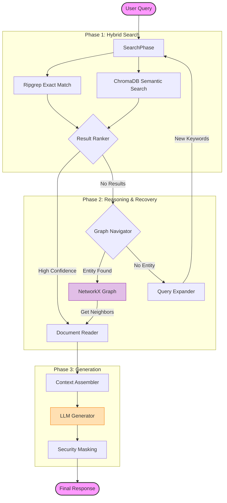

# Jules KB Agent

   [Backend](https://img.shields.io/badge/Backend-Python_3.10+-blue?style=flat-square)
   [UI](https://img.shields.io/badge/UI-Textual_TUI-green?style=flat-square)
   [Database](https://img.shields.io/badge/Data-ChromaDB_%2B_NetworkX-orange?style=flat-square)

   **A Next-Generation Agentic Knowledge System for Internal Banking Documents.**

## 📖 Introduction

   **Jules KB Agent** is an advanced, local-first knowledge retrieval system designed to bridge the gap between unstructured documentation (Markdown, Word, Excel) and structured architectural knowledge. Unlike traditional RAG systems that rely solely on vector similarity, this system employs a **Hybrid Agentic Workflow** that combines:

    1. **Vector Search**: Fast, semantic retrieval from ChromaDB.
    2. **Grep Search**: Precise keyword matching using `ripgrep`.
    3. **Graph Navigation**: Knowledge Graph reasoning using NetworkX to trace Jira links and document hierarchies.
    4. **Agentic Orchestration**: A smart engine that evaluates retrieval sufficiency and dynamically routes queries.

   Designed for **high-security banking environments**, it provides traceability, audit logging, and data masking (PII/PCI) in a strictly local execution model.

---

## 🌟 Key Features

### 🧠 Intelligent Agent Workflow

*   **Hybrid Search Pattern**: "Precision First" approach. The agent checks `grep` exact matches first, then semantic vector results.
*   **Graph Navigation**: If search fails, it autonomously traverses the Knowledge Graph to find related entities (Parent Jira Tickets, Linked Wiki Pages).
*   **Self-Correction**: If context is insufficient, the agent generates alternative queries (synonyms, acronyms) and retries.

### 🕸️ Knowledge Graph Power

*   **Jira Link Tracing**: Automatically identifies `Parent: [ID]`, `Clones: [ID]` patterns and traverses the relationship chain.
*   **Hierarchy Mapping**: Understands folder structures (`(Folder)-[CONTAINS]->(File)`).
*   **Internal Linking**: Resolves `[[WikiLinks]]` and standard Markdown links.

### 🛡️ Enterprise Grade Security

*   **Data Masking**: Output is filtered to mask 16-digit credit card numbers.
*   **Audit Trail**: Every action (Search, Tool Use, LLM Call) is logged to `audit.log` with timestamps.
*   **Local Execution**: No data leaves the environment (except for LLM inference to the configured provider).

### ⚡ Modern TUI (Terminal UI)

*   **Textual Framework**: A rich, interactive terminal interface usable over SSH.
*   **Live Logs**: Watch the "Thought Process" of the agent in real-time.
*   **Split View**: Read Markdown documents while monitoring agent logs.

---

## 🏗️ Architecture

The system follows a modular architecture designed for extensibility and safety.

### Retrieval Pipeline (Mermaid)



---

## 🚀 Getting Started

### Prerequisites

1.  **Python 3.10+**
2.  **Ripgrep** (Recommended for performance, though Python fallback exists).
3.  **LLM API Key**: Compatible with OpenAI API (e.g., OpenAI, Azure, Groq, LocalAI).

### 🛠️ Installation

**1. Clone the repository**

```bash
git clone <repo_url>
cd kb-agent
```

**2. Create a virtual environment**

It is recommended to use a virtual environment to avoid conflicts.

```bash
python3 -m venv .venv
source .venv/bin/activate  # On Windows: .venv\Scripts\activate
```

**3. Install the application**

```bash
pip install .
```

### ⚙️ Configuration

The agent can be configured via environment variables. You can set these in your shell or use the TUI Settings screen on first launch.

```bash
export KB_AGENT_LLM_API_KEY="your-api-key"
export KB_AGENT_LLM_BASE_URL="https://api.openai.com/v1"  # Or your enterprise URL
export KB_AGENT_LLM_MODEL="gpt-4"
export KB_AGENT_DATA_FOLDER="~/data/kb-agent" # Where your source Docs and index are stored
```

---

## 📚 Usage Guide

### 1. Indexing Your Data

Before the agent can search, it needs to process your documents. This step summarizes content and builds the Knowledge Graph.

```bash
# Ensure you have markdown files in your source path
kb-agent index
```

This will:
*   Read files from `KB_AGENT_DATA_FOLDER/source`.
*   Generate summaries using the LLM.
*   Embed content into ChromaDB.
*   Extract links and build the Knowledge Graph in `KB_AGENT_DATA_FOLDER/index/knowledge_graph.json`.
*   **Archive source files** to `KB_AGENT_DATA_FOLDER/archive` to prevent re-indexing.

### 2. Running the Agent (TUI)

Launch the interactive interface:

```bash
kb-agent
```

**Interface Controls:**
*   **Input Box**: Type your natural language query here.
*   **Log Panel (Right)**: Shows the agent's internal reasoning (e.g., "Searching...", "Found link [ISSUE-123], tracing...").
*   **Viewer (Left)**: Displays the final answer in rendered Markdown.

### 3. Settings

If you haven't set environment variables, the Agent will show a **Settings Modal** on startup. Enter your API Key and Base URL there.

---

## 🧪 Development

### Project Structure

```text
src/kb_agent/
├── cli.py              # Entry point
├── config.py           # Configuration (Pydantic)
├── engine.py           # Core Agent Logic (The "Brain")
├── tui.py              # Terminal UI (Textual)
├── processor.py        # Indexing & Summarization
├── audit.py            # Audit Logging
├── security.py         # PII Masking
├── graph/
│   └── graph_builder.py # NetworkX Graph Construction
├── tools/
│   ├── grep_tool.py    # Ripgrep Wrapper
│   ├── vector_tool.py  # ChromaDB Wrapper
│   ├── graph_tool.py   # Graph Traversal Tool
│   └── file_tool.py    # File Reader
└── connectors/         # Data Ingestion
```

### Running Tests

```bash
pip install pytest
python3 -m pytest tests/
```

---

## 🤝 Contributing

1.  Fork the repository.
2.  Create a feature branch.
3.  Commit your changes.
4.  Push to the branch.
5.  Open a Pull Request.

---

© 2026 Jules Agent Team | Internal Use Only
