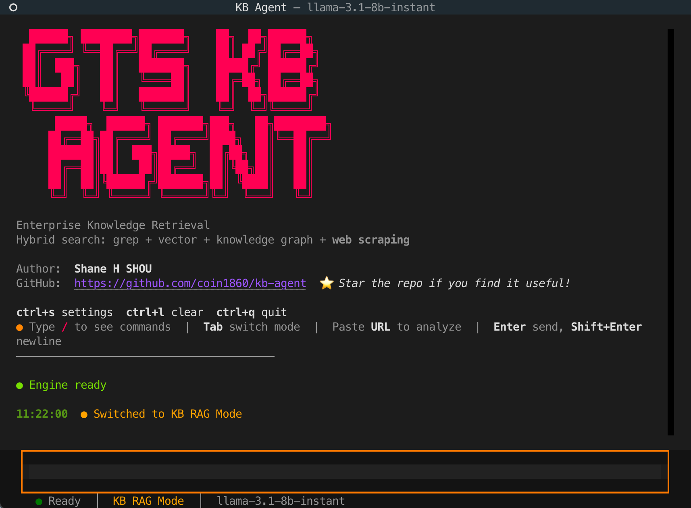
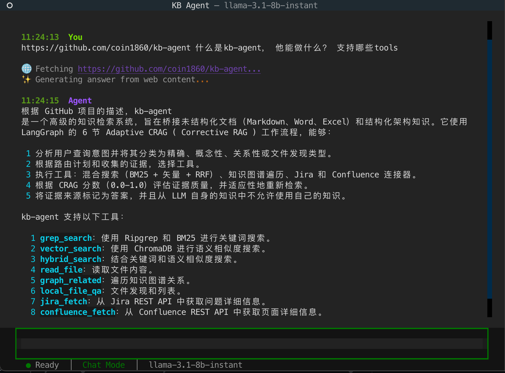
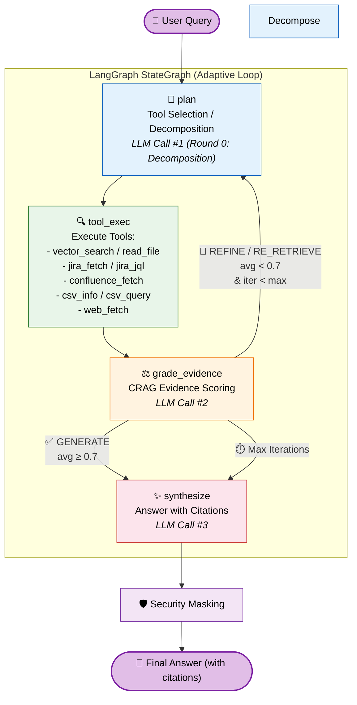

# KB Agent


**A Next-Generation Agentic Knowledge System for Internal Banking Documents.**




## 📖 Introduction

**KB Agent** is an advanced, local-first knowledge retrieval system designed to bridge the gap between unstructured documentation (Markdown, Word, Excel, PDF) and structured architectural knowledge. Unlike traditional RAG systems that rely solely on vector similarity, this system employs an **Adaptive CRAG Workflow** powered by **LangGraph** that autonomously:

1. **Analyzes** query intent using LLM-based query decomposition for parallel searches.
2. **Plans** which tools to call based on discovered file/page clues and gathered evidence.
3. **Executes** tools: vector search, knowledge graph traversal, Jira & Confluence connectors, web fetch, and file reading. Deduplicates chunks on the fly.
4. **Grades** evidence quality with CRAG scoring (0.0–1.0) and adaptively re-retrieves if needed.
5. **Synthesizes** a grounded answer with **source citations** — never from the LLM's own knowledge.

Designed for **high-security banking environments**, it provides traceability, audit logging, and data masking (PII/PCI) in a strictly local execution model.

---

## 🌟 Key Features

### 🧠 Adaptive CRAG with LangGraph

* **Query Intent Decomposition**: Incoming queries are analyzed and split into parallel sub-queries for maximum recall.
* **Intelligent Retry**: Follows discovered context clues (Jira IDs, File Paths, Confluence Pages) on retry rounds instead of blindly re-searching.
* **CRAG Evidence Grading**: Each evidence item is scored 0.0–1.0. The system routes to GENERATE (avg ≥ 0.7), REFINE (0.3–0.7), or RE-RETRIEVE (< 0.3).
* **Interactive Source Citations**: Answers include clickable references; click to view the full source chunk in a modal window.
* **Anti-Hallucination**: The LLM is strictly forbidden from using its own parametric knowledge. All answers must come from retrieved evidence or conversation history.
* **CSV Data Analysis**: Native support for querying large CSV files using structured Pandas filters, avoiding truncation issues in standard vector indexing.
* **Recursive Reasoning Loop**: `Decompose → Plan → Execute → Grade → (loop or answer)` with a configurable iteration cap (default 3).

> 📖 **[Architecture Deep-Dive →](docs/agentic-rag-architecture.md)** — Mermaid diagrams, LLM call analysis, and enhancement roadmap.

### 🔧 Agent Tools

| Tool | Backend | Purpose |
|---|---|---|
| `vector_search` | ChromaDB | Semantic similarity search over indexed documents |
| `read_file` | FileTool | Read document content (supports `start_line`/`end_line` for partial reads) |
| `jira_fetch` | Jira API | Fetch Jira issue details (includes sub-tasks and linked issues) |
| `jira_jql` | Jira API | Natural language → JQL search (e.g. "my unresolved tasks") |
| `confluence_fetch`| Confluence API| Fetch Confluence page details by ID or title |
| `web_fetch` | HTTP + HTML→MD| Fetch and convert web pages (markdownify or crawl4ai) |
| `local_file_qa` | Vector + Filename| File discovery and Q&A on specific files |
| `csv_info` | Pandas | Get CSV schema (columns, types) and data sample |
| `csv_query` | Pandas | Query CSV using structured JSON (filters and column selection) |
| `graph_related`* | NetworkX | Traverse Knowledge Graph relationships (*Experimental*) |
| `grep_search`* | Ripgrep | Keyword search with context windows (*Disabled*) |

### 🕸️ Knowledge Graph

* **Jira Link Tracing**: Automatically identifies `Parent: [ID]`, `Clones: [ID]` patterns and traverses the relationship chain.
* **Hierarchy Mapping**: Understands folder structures (`(Folder)-[CONTAINS]->(File)`).
* **Internal Linking**: Resolves `[[WikiLinks]]` and standard Markdown links.

### 🛡️ Enterprise Grade Security

* **Data Masking**: Output is filtered to mask credit card numbers.
* **Audit Trail**: Every action (Search, Tool Use, LLM Call) is logged to `audit.log` with timestamps.
* **Local Execution**: No data leaves the environment (except for LLM inference to the configured provider).

### ⚡ Modern TUI (Terminal UI)

* **Textual Framework**: A rich, interactive terminal interface usable over SSH.
* **Live Agent Thinking**: Watch the agent's step-by-step progress in real-time (🧠 Planning → 🔍 Searching → ⚖️ Evaluating → ✨ Synthesizing).
* **Dual Mode**: Switch between **KB RAG Mode** (knowledge retrieval) and **Chat Mode** (general conversation) with `Tab`.
* **Two-Level Settings**: Category-based settings navigation (LLM / RAG / Atlassian / General) with keyboard-driven UI.
* **Slash Commands**: `/index`, `/file_search`, `/sync_confluence`, `/web_engine`, `/settings`, `/help`, `/clear`, `/quit`.
* **LLM Usage Tracking**: Token consumption stats (prompt / completion / total) displayed per response.

---

## 🏗️ Architecture

### Agentic RAG Graph (LangGraph)


```mermaid
graph TD
    Start(["🎯 User Query"]) --> Plan

    subgraph "LangGraph StateGraph (Adaptive Loop)"
        Plan["🧠 plan<br/>Tool Selection / Decomposition<br/><i>LLM Call #1 (Round 0: Decomposition)</i>"]
        ToolExec["🔍 tool_exec<br/>Execute Tools:<br/>- vector_search / read_file<br/>- jira_fetch / jira_jql<br/>- confluence_fetch<br/>- csv_info / csv_query<br/>- web_fetch"]
        Grade["⚖️ grade_evidence<br/>CRAG Evidence Scoring<br/><i>LLM Call #2</i>"]
        Synth["✨ synthesize<br/>Answer with Citations<br/><i>LLM Call #3</i>"]

        Plan --> ToolExec
        ToolExec --> Grade
        Grade -->|"✅ GENERATE<br/>avg ≥ 0.7"| Synth
        Grade -->|"🔄 REFINE / RE_RETRIEVE<br/>avg < 0.7<br/>& iter < max"| Plan
        Grade -->|"⏱️ Max Iterations"| Synth
    end

    Synth --> Mask["🛡️ Security Masking"]
    Mask --> End(["📝 Final Answer (with citations)"])

    style Start fill:#e1bee7,stroke:#7b1fa2,stroke-width:2px,color:#000
    style End fill:#e1bee7,stroke:#7b1fa2,stroke-width:2px,color:#000
    style Decompose fill:#e3f2fd,stroke:#1565c0,color:#000
    style Plan fill:#e3f2fd,stroke:#1565c0,color:#000
    style ToolExec fill:#e8f5e9,stroke:#2e7d32,color:#000
    style Grade fill:#fff3e0,stroke:#ef6c00,color:#000
    style Synth fill:#fce4ec,stroke:#c62828,color:#000
    style Mask fill:#f3e5f5,stroke:#6a1b9a,color:#000
```

### AgentState Schema

All nodes read from and write to a shared `AgentState`:

| Field | Type | Description |
|---|---|---|
| `query` | `str` | Current user question |
| `messages` | `list[dict]` | Full conversation history (multi-turn) |
| `context` | `list[str]` | Accumulated evidence from tools (with `[SOURCE:]` tags) |
| `context_file_hints` | `list[str]` | Tracked clues (file paths, Jira IDs) across grading rounds |
| `tool_history` | `list[dict]` | Log of tool invocations |
| `files_read` | `list[str]` | Files already read (prevents duplicate `read_file` calls) |
| `evidence_scores` | `list[float]` | Relevance scores (0.0–1.0) from CRAG grader |
| `grader_action` | `str` | CRAG decision: `GENERATE` / `REFINE` / `RE_RETRIEVE` |
| `iteration` | `int` | Loop counter (capped at `max_iterations`, default 3) |
| `final_answer` | `str` | Synthesised answer with citation footer |
| `llm_call_count` | `int` | Total LLM invocations in this query |
| `llm_total_tokens` | `int` | Total tokens consumed |
| `status_callback` | `callable` | TUI progress callback |

### Anti-Hallucination Design

1. **Plan Node**: System prompt explicitly says *"You must NEVER answer the question yourself — only plan tool calls."*
2. **Synthesize Node**: System prompt enforces *"Answer ONLY from the provided context and conversation history. Do NOT use your own knowledge."*
3. **No-Evidence Refusal**: If tools find nothing useful, the agent responds: *"I couldn't find relevant information in the knowledge base."*
4. **Multi-Turn Grounding**: Follow-up answers are constrained to conversation history + new tool results only.

---

## 🚀 Getting Started

### Prerequisites

1. **Python 3.10+**
2. **LLM API Key**: Compatible with OpenAI API (e.g., OpenAI, Groq, DeepSeek, LocalAI, etc.).

### 🛠️ Installation

**1. Clone the repository**

```bash
git clone https://github.com/coin1860/kb-agent.git
cd kb-agent
```

**2. Create a virtual environment**

```bash
python3 -m venv .venv
source .venv/bin/activate  # On Windows: .venv\Scripts\activate
```

**3. Install the application**

```bash
pip install .
```

### ⚙️ Configuration

The agent can be configured via environment variables or via the **TUI Settings screen** (Ctrl+S).

```bash
export KB_AGENT_LLM_API_KEY="your-api-key"
export KB_AGENT_LLM_BASE_URL="https://api.openai.com/v1"  # Or your enterprise URL
export KB_AGENT_LLM_MODEL="gpt-4"
export KB_AGENT_DATA_FOLDER="~/data/kb-agent"
```

Settings are persisted to `kb-agent.json` automatically.

#### Settings Categories

| Category | Fields |
|---|---|
| **LLM** | API Key, Base URL, Model, Embedding URL, Embedding Model |
| **RAG** | Max Iterations, Vector Score Threshold, Chunk Max Chars, Chunk Overlap Chars |
| **Atlassian** | Jira URL, Jira Token, Confluence URL, Confluence Token |
| **General** | Data Folder, Debug Mode |

---

## 📚 Usage Guide

### 1. Indexing Your Data

Before the agent can search, it needs to process your documents.

```bash
kb-agent index
```

This will:
* Read files from `data_folder/source` (supports `.txt`, `.md`, `.pdf`, `.docx`, `.xlsx`, `.csv`).
* Generate summaries using the configured LLM.
* Embed content into ChromaDB with markdown-aware semantic chunking.
* Extract links and build the Knowledge Graph (`knowledge_graph.json`).
* **Archive source files** to `data_folder/archive` to prevent re-indexing.

### 2. Running the Agent (TUI)

Launch the interactive interface:

```bash
kb-agent
```

**Keyboard Controls:**

| Key | Action |
|---|---|
| `Enter` | Send message |
| `Shift+Enter` | New line |
| `Tab` | Toggle KB RAG / Chat mode |
| `Ctrl+S` | Open Settings |
| `Ctrl+L` | Clear chat |
| `Ctrl+Q` | Quit |

### 3. Slash Commands

| Command | Description |
|---|---|
| `/index <url>` | Index a URL, Jira ticket, or Confluence page into the KB |
| `/file_search <query>` | Search files in the knowledge base (parallel sub-query decomposition) |
| `/sync_confluence <page_id>` | Sync a Confluence page tree recursively |
| `/web_engine [markdownify\|crawl4ai]` | Switch web scraping engine |
| `/settings` | Open settings dialog |
| `/help` | Show available commands |
| `/clear` | Clear chat history |
| `/quit` | Exit the application |

### 4. Inline URL Indexing

Paste any HTTP/HTTPS URL directly into the chat to fetch, parse, and index the web page content automatically.

---

## 🧪 Development

### Project Structure

```text
src/kb_agent/
├── cli.py              # Entry point (index / tui commands)
├── config.py           # Configuration (Pydantic Settings)
├── engine.py           # Public API — delegates to LangGraph or direct LLM
├── tui.py              # Terminal UI (Textual) — two-level settings, chat, slash commands
├── processor.py        # Indexing & Summarization
├── chunking.py         # Markdown-aware semantic chunking (header split + paragraph overlap)
├── audit.py            # Audit Logging
├── security.py         # PII Masking
├── llm.py              # OpenAI-compatible LLM client
├── agent/              # ⭐ Adaptive CRAG (LangGraph)
│   ├── state.py        # AgentState TypedDict
│   ├── tools.py        # LangChain @tool wrappers
│   ├── nodes.py        # Graph nodes (decompose, plan, tool, grade, synthesize)
│   └── graph.py        # StateGraph topology & CRAG routing
├── graph/
│   └── graph_builder.py # NetworkX Knowledge Graph construction
├── tools/
│   ├── grep_tool.py    # Ripgrep wrapper
│   ├── vector_tool.py  # ChromaDB wrapper
│   ├── graph_tool.py   # Graph traversal tool
│   ├── csv_qa_tool.py  # CSV schema & query execution
│   └── file_tool.py    # File reader (auto source→index resolution)
└── connectors/
    ├── base.py          # Base connector interface
    ├── jira.py          # Jira connector (issue fetch + JQL search)
    ├── confluence.py    # Confluence connector (page fetch + tree sync)
    ├── web_connector.py # Web scraping (markdownify / crawl4ai)
    └── local_file.py    # Local file connector (MD, TXT, PDF, DOCX, XLSX)
```

### Running Tests

```bash
pip install pytest pytest-asyncio
python3 -m pytest tests/ -v
```

**Test coverage (108 tests):**
* `test_agent_graph.py` — Agent nodes, CRAG routing, multi-turn, anti-hallucination
* `test_analyze_and_route.py` — Query intent classification
* `test_grade_evidence.py` — CRAG evidence grading
* `test_hybrid_search.py` — BM25 + Vector RRF fusion
* `test_engine_mock.py` — Engine public API: KB mode, normal mode, URL mode
* `test_security.py` — PII data masking
* `test_web_connector.py` — Web scraping connector
* `test_tui.py` — Terminal UI components (settings, chat, slash commands)

### OpenSpec Workflow

This project uses the **OpenSpec** methodology for managing changes. Specs live under `openspec/specs/` and cover 21 capabilities across retrieval, routing, synthesis, ingestion, and observability.

```bash
# List active changes
openspec list

# Start a new change
openspec new <change-name>
```

---

## 🤝 Contributing

1. Fork the repository.
2. Create a feature branch.
3. Commit your changes.
4. Push to the branch.
5. Open a Pull Request.

---

© 2026 KB Agent | Internal Use Only
