# Jules KB Agent

   [Backend](https://img.shields.io/badge/Backend-Python_3.10+-blue?style=flat-square)
   [UI](https://img.shields.io/badge/UI-Textual_TUI-green?style=flat-square)
   [Database](https://img.shields.io/badge/Data-ChromaDB_%2B_NetworkX-orange?style=flat-square)
   [Orchestration](https://img.shields.io/badge/Agent-LangGraph_1.0-purple?style=flat-square)

   **A Next-Generation Agentic Knowledge System for Internal Banking Documents.**

## 📖 Introduction

   **Jules KB Agent** is an advanced, local-first knowledge retrieval system designed to bridge the gap between unstructured documentation (Markdown, Word, Excel) and structured architectural knowledge. Unlike traditional RAG systems that rely solely on vector similarity, this system employs an **Agentic RAG Workflow** powered by **LangGraph** that autonomously:

    1. **Plans** which tools to call based on the user's query and gathered evidence.
    2. **Executes** tools: keyword search (ripgrep), semantic search (ChromaDB), knowledge graph traversal (NetworkX), Jira & Confluence connectors.
    3. **Evaluates** whether the retrieved evidence is sufficient to answer the question.
    4. **Synthesizes** a grounded answer from the evidence — never from the LLM's own knowledge.

   Designed for **high-security banking environments**, it provides traceability, audit logging, and data masking (PII/PCI) in a strictly local execution model.

---

## 🌟 Key Features

### 🧠 Agentic RAG with LangGraph

*   **Autonomous Planning**: The LLM decides which tools to invoke — no hard-coded if-else branches.
*   **Recursive Reasoning Loop**: `Plan → Execute → Evaluate → (loop or answer)` with a 3-iteration safety cap.
*   **Anti-Hallucination**: The LLM is strictly forbidden from using its own parametric knowledge. All answers must come from retrieved evidence or conversation history. If nothing is found, the agent honestly says "I couldn't find relevant information."
*   **Multi-Turn Conversation**: Full conversation history is passed through the agent state, enabling natural follow-up questions grounded in prior context.

### 🔧 Six Agent Tools

| Tool | Backend | Purpose |
|---|---|---|
| `grep_search` | Ripgrep | Exact keyword matching on indexed .md files |
| `vector_search` | ChromaDB | Semantic similarity search |
| `read_file` | FileTool | Read full document content by path |
| `graph_related` | NetworkX | Traverse Knowledge Graph relationships |
| `jira_fetch` | Jira REST API | Fetch Jira issue details by key |
| `confluence_fetch` | Confluence REST API | Fetch Confluence page by ID/title |

### 🕸️ Knowledge Graph Power

*   **Jira Link Tracing**: Automatically identifies `Parent: [ID]`, `Clones: [ID]` patterns and traverses the relationship chain.
*   **Hierarchy Mapping**: Understands folder structures (`(Folder)-[CONTAINS]->(File)`).
*   **Internal Linking**: Resolves `[[WikiLinks]]` and standard Markdown links.

### 🛡️ Enterprise Grade Security

*   **Data Masking**: Output is filtered to mask 16-digit credit card numbers.
*   **Audit Trail**: Every action (Search, Tool Use, LLM Call) is logged to `audit.log` with timestamps.
*   **Local Execution**: No data leaves the environment (except for LLM inference to the configured provider).

### ⚡ Modern TUI (Terminal UI)

*   **Textual Framework**: A rich, interactive terminal interface usable over SSH.
*   **Live Agent Thinking**: Watch the agent's step-by-step progress in real-time (🧠 Planning → 🔍 Searching → 🤔 Evaluating → ✨ Synthesizing).
*   **Dual Mode**: Switch between **KB RAG Mode** (knowledge retrieval) and **Chat Mode** (general conversation) with `Tab`.
*   **Web Scraping**: Paste a URL to fetch, parse, and analyze web page content.

---

## 🏗️ Architecture

### Agentic RAG Graph (LangGraph)

```mermaid
graph TD
    Start([User Query]) --> Plan

    subgraph "LangGraph StateGraph (max 3 iterations)"
        Plan["🧠 Plan Node<br/>LLM picks tools"] --> ToolExec["🔍 Tool Node<br/>Execute tool calls"]
        ToolExec --> Evaluate["🤔 Evaluate Node<br/>Is evidence sufficient?"]
        Evaluate -->|"✅ Sufficient"| Synthesize["✨ Synthesize Node<br/>Generate grounded answer"]
        Evaluate -->|"❌ Not sufficient<br/>& iteration < 3"| Plan
        Evaluate -->|"❌ Not sufficient<br/>& iteration ≥ 3"| Synthesize
    end

    Synthesize --> Masking[Security Masking]
    Masking --> End([Final Response])

    style Start fill:#f9f,stroke:#333,stroke-width:2px
    style End fill:#f9f,stroke:#333,stroke-width:2px
    style Plan fill:#e3f2fd,stroke:#1565c0
    style ToolExec fill:#e8f5e9,stroke:#2e7d32
    style Evaluate fill:#fff3e0,stroke:#ef6c00
    style Synthesize fill:#fce4ec,stroke:#c62828
```



### AgentState Schema

All nodes read from and write to a shared `AgentState`:

| Field | Type | Description |
|---|---|---|
| `query` | `str` | Current user question |
| `messages` | `list[dict]` | Full conversation history (multi-turn) |
| `context` | `list[str]` | Accumulated evidence from tools |
| `tool_history` | `list[dict]` | Log of tool invocations |
| `iteration` | `int` | Loop counter (capped at 3) |
| `is_sufficient` | `bool` | Evaluator verdict |
| `final_answer` | `str` | Synthesised answer |
| `status_callback` | `callable` | TUI progress callback |

### Anti-Hallucination Design

1. **Plan Node**: System prompt explicitly says *"You must NEVER answer the question yourself — only plan tool calls."*
2. **Synthesize Node**: System prompt enforces *"Answer ONLY from the provided context and conversation history. Do NOT use your own knowledge."*
3. **No-Evidence Refusal**: If tools find nothing useful, the agent responds: *"I couldn't find relevant information in the knowledge base."*
4. **Multi-Turn Grounding**: Follow-up answers are constrained to conversation history + new tool results only.

---

## 🚀 Getting Started

### Prerequisites

1.  **Python 3.10+**
2.  **Ripgrep** (Recommended for performance, though Python fallback exists).
3.  **LLM API Key**: Compatible with OpenAI API (e.g., OpenAI, Azure, Groq, LocalAI).

### 🛠️ Installation

**1. Clone the repository**

```bash
git clone <repo_url>
cd kb-agent
```

**2. Create a virtual environment**

```bash
python3 -m venv .venv
source .venv/bin/activate  # On Windows: .venv\Scripts\activate
```

**3. Install the application**

```bash
pip install .
```

### ⚙️ Configuration

The agent can be configured via environment variables. You can set these in your shell or use the TUI Settings screen on first launch.

```bash
export KB_AGENT_LLM_API_KEY="your-api-key"
export KB_AGENT_LLM_BASE_URL="https://api.openai.com/v1"  # Or your enterprise URL
export KB_AGENT_LLM_MODEL="gpt-4"
export KB_AGENT_DATA_FOLDER="~/data/kb-agent" # Where your source Docs and index are stored
```

---

## 📚 Usage Guide

### 1. Indexing Your Data

Before the agent can search, it needs to process your documents. This step summarizes content and builds the Knowledge Graph.

```bash
# Ensure you have markdown files in your source path
kb-agent index
```

This will:
*   Read files from `KB_AGENT_DATA_FOLDER/source`.
*   Generate summaries using the LLM.
*   Embed content into ChromaDB.
*   Extract links and build the Knowledge Graph in `KB_AGENT_DATA_FOLDER/index/knowledge_graph.json`.
*   **Archive source files** to `KB_AGENT_DATA_FOLDER/archive` to prevent re-indexing.

### 2. Running the Agent (TUI)

Launch the interactive interface:

```bash
kb-agent
```

**Interface Controls:**
*   **Input Box**: Type your natural language query here.
*   **Chat Log**: Shows the agent's step-by-step thinking (🧠 Planning → 🔍 Searching → 🤔 Evaluating → ✨ Synthesizing).
*   **Tab**: Toggle between KB RAG Mode and Chat Mode.
*   **Enter**: Send message. **Shift+Enter**: New line.
*   **Ctrl+S**: Settings. **Ctrl+L**: Clear. **Ctrl+Q**: Quit.

### 3. Settings

If you haven't set environment variables, the Agent will show a **Settings Modal** on startup. Enter your API Key and Base URL there.

---

## 🧪 Development

### Project Structure

```text
src/kb_agent/
├── cli.py              # Entry point
├── config.py           # Configuration (Pydantic)
├── engine.py           # Public API — delegates to LangGraph or direct LLM
├── tui.py              # Terminal UI (Textual)
├── processor.py        # Indexing & Summarization
├── audit.py            # Audit Logging
├── security.py         # PII Masking
├── llm.py              # OpenAI-compatible LLM client
├── agent/              # ⭐ Agentic RAG (LangGraph)
│   ├── state.py        # AgentState TypedDict
│   ├── tools.py        # 6 LangChain @tool wrappers
│   ├── nodes.py        # Graph node functions (plan, tool, evaluate, synthesize)
│   └── graph.py        # StateGraph definition & compilation
├── graph/
│   └── graph_builder.py # NetworkX Knowledge Graph construction
├── tools/
│   ├── grep_tool.py    # Ripgrep wrapper
│   ├── vector_tool.py  # ChromaDB wrapper
│   ├── graph_tool.py   # Graph traversal tool
│   └── file_tool.py    # File reader
└── connectors/         # Data ingestion (Jira, Confluence, Web, Local)
```

### Running Tests

```bash
pip install pytest
python3 -m pytest tests/ -v
```

**Test coverage:**
*   `test_agent_graph.py` — Agent nodes, routing, multi-turn, anti-hallucination (17 tests)
*   `test_engine_mock.py` — Engine public API: KB mode, normal mode, URL mode (8 tests)
*   `test_security.py` — PII data masking
*   `test_processor_mock.py` — Document processing pipeline
*   `test_web_connector.py` — Web scraping connector
*   `test_tui.py` — Terminal UI components

---

## 🤝 Contributing

1.  Fork the repository.
2.  Create a feature branch.
3.  Commit your changes.
4.  Push to the branch.
5.  Open a Pull Request.

---

© 2026 Jules Agent Team | Internal Use Only
