# GTS KB Agent

   [Backend](https://img.shields.io/badge/Backend-Python_3.10+-blue?style=flat-square)
   [UI](https://img.shields.io/badge/UI-Textual_TUI-green?style=flat-square)
   [Database](https://img.shields.io/badge/Data-ChromaDB_%2B_NetworkX-orange?style=flat-square)
   [Orchestration](https://img.shields.io/badge/Agent-LangGraph_1.0-purple?style=flat-square)

   **A Next-Generation Agentic Knowledge System for Internal Banking Documents.**


## 📖 Introduction

   **GTS KB Agent** is an advanced, local-first knowledge retrieval system designed to bridge the gap between unstructured documentation (Markdown, Word, Excel, PDF) and structured architectural knowledge. Unlike traditional RAG systems that rely solely on vector similarity, this system employs an **Adaptive CRAG Workflow** powered by **LangGraph** that autonomously:

    1. **Analyzes** query intent and classifies it (exact / conceptual / relational / file_discovery).
    2. **Plans** which tools to call based on the routing plan and gathered evidence.
    3. **Executes** tools: hybrid search (BM25 + Vector + RRF), knowledge graph traversal, Jira & Confluence connectors.
    4. **Grades** evidence quality with CRAG scoring (0.0-1.0) and adaptively re-retrieves if needed.
    5. **Synthesizes** a grounded answer with **source citations** — never from the LLM's own knowledge.

   Designed for **high-security banking environments**, it provides traceability, audit logging, and data masking (PII/PCI) in a strictly local execution model.

---

## 🌟 Key Features

### 🧠 Adaptive CRAG with LangGraph

*   **Query Intent Analysis**: Incoming queries are classified into 4 intent types (`exact`, `conceptual`, `relational`, `file_discovery`) with automatic sub-question decomposition.
*   **Hybrid Retrieval**: BM25-scored ripgrep + ChromaDB vector search fused via Reciprocal Rank Fusion (RRF, k=60).
*   **CRAG Evidence Grading**: Each evidence item is scored 0.0–1.0. Low-scored items (< 0.3) are filtered. The system routes to GENERATE (avg ≥ 0.7), REFINE (0.3–0.7), or RE-RETRIEVE (< 0.3).
*   **Source Citations**: Answers include inline `[N]` references and a citation footer with file paths and line numbers.
*   **Anti-Hallucination**: The LLM is strictly forbidden from using its own parametric knowledge. All answers must come from retrieved evidence or conversation history.
*   **Multi-Turn Conversation**: Full conversation history is passed through the agent state, enabling natural follow-up questions grounded in prior context.
*   **Recursive Reasoning Loop**: `Analyze → Plan → Execute → Grade → (loop or answer)` with a 3-iteration safety cap.

> 📖 **[Architecture Deep-Dive →](docs/agentic-rag-architecture.md)** — Mermaid diagrams, LLM call analysis, and enhancement roadmap.

### 🔧 Agent Tools

| Tool | Backend | Purpose |
|---|---|---|
| `grep_search` | Ripgrep + BM25 | Keyword search with ±10 line context windows |
| `vector_search` | ChromaDB | Semantic similarity search |
| `hybrid_search` | Grep + Vector + RRF | Combined keyword and semantic fusion |
| `read_file` | FileTool | Read full document content by path |
| `graph_related` | NetworkX | Traverse Knowledge Graph relationships |
| `local_file_qa` | Vector + Filename | File discovery and Q&A on specific code repositories/files |
| `jira_fetch` | Jira REST API | Fetch Jira issue details by key |
| `confluence_fetch` | Confluence REST API | Fetch Confluence page by ID/title |
| `web_fetch` | HTTP + HTML→MD | Fetch and convert web pages |
| `index_command` | CLI/TUI | /index command to ingest external resources automatically |

### 🕸️ Knowledge Graph Power

*   **Jira Link Tracing**: Automatically identifies `Parent: [ID]`, `Clones: [ID]` patterns and traverses the relationship chain.
*   **Hierarchy Mapping**: Understands folder structures (`(Folder)-[CONTAINS]->(File)`).
*   **Internal Linking**: Resolves `[[WikiLinks]]` and standard Markdown links.

### 🛡️ Enterprise Grade Security

*   **Data Masking**: Output is filtered to mask 16-digit credit card numbers.
*   **Audit Trail**: Every action (Search, Tool Use, LLM Call) is logged to `audit.log` with timestamps.
*   **Local Execution**: No data leaves the environment (except for LLM inference to the configured provider).

### ⚡ Modern TUI (Terminal UI)

*   **Textual Framework**: A rich, interactive terminal interface usable over SSH.
*   **Live Agent Thinking**: Watch the agent's step-by-step progress in real-time (🧠 Planning → 🔍 Searching → 🤔 Evaluating → ✨ Synthesizing).
*   **Dual Mode**: Switch between **KB RAG Mode** (knowledge retrieval) and **Chat Mode** (general conversation) with `Tab`.
*   **Web Scraping**: Paste a URL to fetch, parse, and analyze web page content.

---

## 🏗️ Architecture

### Agentic RAG Graph (LangGraph) — 6-Node CRAG Topology

```mermaid
graph TD
    Start(["🎯 User Query"]) --> Analyze

    subgraph "LangGraph StateGraph (max 3 iterations)"
        Analyze["🧭 analyze_and_route<br/>Intent Classification + Query Decomposition<br/><i>LLM Call #1</i>"]
        Plan["🧠 plan<br/>Tool Selection & Parameter Planning<br/><i>LLM Call #2</i>"]
        ToolExec["🔍 tool_exec<br/>Execute Supported Tools:<br/>- hybrid_search<br/>- vector_search<br/>- grep_search<br/>- local_file_qa<br/>- read_file<br/>- graph_related<br/>- jira_fetch<br/>- confluence_fetch<br/>- web_fetch<br/>- index_command<br/><i>No LLM Call</i>"]
        Grade["⚖️ grade_evidence<br/>CRAG Evidence Scoring<br/><i>LLM Call #3</i>"]
        Synth["✨ synthesize<br/>Answer with Citations<br/><i>LLM Call #4</i>"]

        Analyze --> Plan
        Plan --> ToolExec
        ToolExec --> Grade
        Grade -->|"✅ GENERATE<br/>avg ≥ 0.7"| Synth
        Grade -->|"🔄 REFINE<br/>0.3 ≤ avg < 0.7<br/>& iter < 3"| Plan
        Grade -->|"🗑️ RE_RETRIEVE<br/>avg < 0.3<br/>& iter < 3"| Analyze
        Grade -->|"⏱️ iter ≥ 3"| Synth
    end

    Synth --> Mask["🛡️ Security Masking"]
    Mask --> End(["📝 Final Answer (with citations)"])

    style Start fill:#e1bee7,stroke:#7b1fa2,stroke-width:2px,color:#000
    style End fill:#e1bee7,stroke:#7b1fa2,stroke-width:2px,color:#000
    style Analyze fill:#e3f2fd,stroke:#1565c0,color:#000
    style Plan fill:#e3f2fd,stroke:#1565c0,color:#000
    style ToolExec fill:#e8f5e9,stroke:#2e7d32,color:#000
    style Grade fill:#fff3e0,stroke:#ef6c00,color:#000
    style Synth fill:#fce4ec,stroke:#c62828,color:#000
    style Mask fill:#f3e5f5,stroke:#6a1b9a,color:#000
```



> 📖 See [docs/agentic-rag-architecture.md](docs/agentic-rag-architecture.md) for full Mermaid diagrams, LLM call sequence analysis, and enhancement roadmap.

### AgentState Schema

All nodes read from and write to a shared `AgentState`:

| Field | Type | Description |
|---|---|---|
| `query` | `str` | Current user question |
| `messages` | `list[dict]` | Full conversation history (multi-turn) |
| `query_type` | `str` | Intent classification (`exact`/`conceptual`/`relational`/`file_discovery`) |
| `routing_plan` | `dict` | Structured routing plan with suggested tools and keywords |
| `sub_questions` | `list[str]` | Decomposed sub-questions for complex queries |
| `context` | `list[str]` | Accumulated evidence from tools (with `[SOURCE:]` tags) |
| `tool_history` | `list[dict]` | Log of tool invocations |
| `evidence_scores` | `list[float]` | Relevance scores (0.0-1.0) from CRAG grader |
| `grader_action` | `str` | CRAG decision: `GENERATE` / `REFINE` / `RE_RETRIEVE` |
| `iteration` | `int` | Loop counter (capped at `KB_AGENT_MAX_ITERATIONS`, default 3) |
| `final_answer` | `str` | Synthesised answer with citation footer |
| `status_callback` | `callable` | TUI progress callback |

### Anti-Hallucination Design

1. **Plan Node**: System prompt explicitly says *"You must NEVER answer the question yourself — only plan tool calls."*
2. **Synthesize Node**: System prompt enforces *"Answer ONLY from the provided context and conversation history. Do NOT use your own knowledge."*
3. **No-Evidence Refusal**: If tools find nothing useful, the agent responds: *"I couldn't find relevant information in the knowledge base."*
4. **Multi-Turn Grounding**: Follow-up answers are constrained to conversation history + new tool results only.

---

## 🚀 Getting Started

### Prerequisites

1.  **Python 3.10+**
2.  **Ripgrep** (Recommended for performance, though Python fallback exists).
3.  **LLM API Key**: Compatible with OpenAI API (e.g., OpenAI, Azure, Groq, LocalAI).

### 🛠️ Installation

**1. Clone the repository**

```bash
git clone <repo_url>
cd kb-agent
```

**2. Create a virtual environment**

```bash
python3 -m venv .venv
source .venv/bin/activate  # On Windows: .venv\Scripts\activate
```

**3. Install the application**

```bash
pip install .
```

### ⚙️ Configuration

The agent can be configured via environment variables. You can set these in your shell or use the TUI Settings screen on first launch.

```bash
export KB_AGENT_LLM_API_KEY="your-api-key"
export KB_AGENT_LLM_BASE_URL="https://api.openai.com/v1"  # Or your enterprise URL
export KB_AGENT_LLM_MODEL="gpt-4"
export KB_AGENT_DATA_FOLDER="~/data/kb-agent" # Where your source Docs and index are stored
```

---

## 📚 Usage Guide

### 1. Indexing Your Data

Before the agent can search, it needs to process your documents. This step summarizes content and builds the Knowledge Graph.

```bash
# Ensure you have markdown files in your source path
kb-agent index
```

This will:
*   Read files from `KB_AGENT_DATA_FOLDER/source`.
*   Generate summaries using the LLM.
*   Embed content into ChromaDB.
*   Extract links and build the Knowledge Graph in `KB_AGENT_DATA_FOLDER/index/knowledge_graph.json`.
*   **Archive source files** to `KB_AGENT_DATA_FOLDER/archive` to prevent re-indexing.

### 2. Running the Agent (TUI)

Launch the interactive interface:

```bash
kb-agent
```

**Interface Controls:**
*   **Input Box**: Type your natural language query here.
*   **Chat Log**: Shows the agent's step-by-step thinking (🧠 Planning → 🔍 Searching → 🤔 Evaluating → ✨ Synthesizing).
*   **Tab**: Toggle between KB RAG Mode and Chat Mode.
*   **Enter**: Send message. **Shift+Enter**: New line.
*   **Ctrl+S**: Settings. **Ctrl+L**: Clear. **Ctrl+Q**: Quit.

### 3. Settings

If you haven't set environment variables, the Agent will show a **Settings Modal** on startup. Enter your API Key and Base URL there.

---

## 🧪 Development

### Project Structure

```text
src/kb_agent/
├── cli.py              # Entry point
├── config.py           # Configuration (Pydantic)
├── engine.py           # Public API — delegates to LangGraph or direct LLM
├── tui.py              # Terminal UI (Textual)
├── processor.py        # Indexing & Summarization
├── audit.py            # Audit Logging
├── security.py         # PII Masking
├── llm.py              # OpenAI-compatible LLM client
├── agent/              # ⭐ Adaptive CRAG (LangGraph)
│   ├── state.py        # AgentState TypedDict (17 fields)
│   ├── tools.py        # 9 LangChain @tool wrappers (incl. hybrid_search)
│   ├── nodes.py        # 5 graph nodes (analyze, plan, tool, grade, synthesize)
│   └── graph.py        # 6-node StateGraph topology & CRAG routing
├── graph/
│   └── graph_builder.py # NetworkX Knowledge Graph construction
├── tools/
│   ├── grep_tool.py    # Ripgrep wrapper
│   ├── vector_tool.py  # ChromaDB wrapper
│   ├── graph_tool.py   # Graph traversal tool
│   └── file_tool.py    # File reader
└── connectors/         # Data ingestion (Jira, Confluence, Web, Local)
```

### Running Tests

```bash
pip install pytest
python3 -m pytest tests/ -v
```

**Test coverage (105 tests):**
*   `test_agent_graph.py` — Agent nodes, CRAG routing, multi-turn, anti-hallucination (20 tests)
*   `test_analyze_and_route.py` — Query intent classification (5 tests)
*   `test_grade_evidence.py` — CRAG evidence grading (5 tests)
*   `test_hybrid_search.py` — BM25 + Vector RRF fusion (4 tests)
*   `test_engine_mock.py` — Engine public API: KB mode, normal mode, URL mode (8 tests)
*   `test_security.py` — PII data masking
*   `test_web_connector.py` — Web scraping connector
*   `test_tui.py` — Terminal UI components (27 tests)

---

## 🤝 Contributing

1.  Fork the repository.
2.  Create a feature branch.
3.  Commit your changes.
4.  Push to the branch.
5.  Open a Pull Request.

---

© 2026 GTS Agent Team | Internal Use Only
