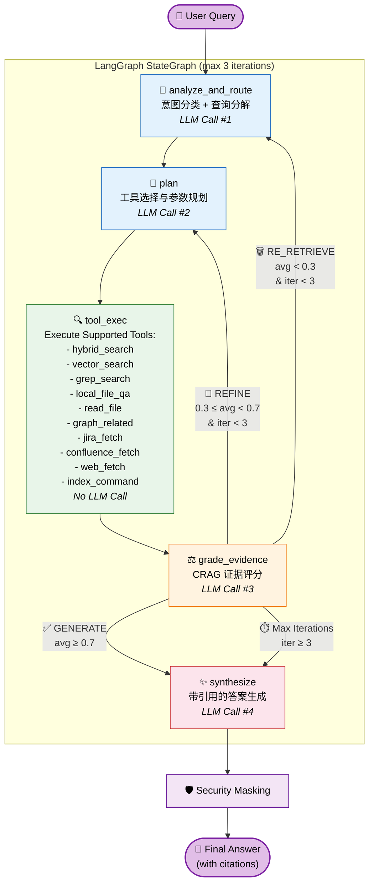
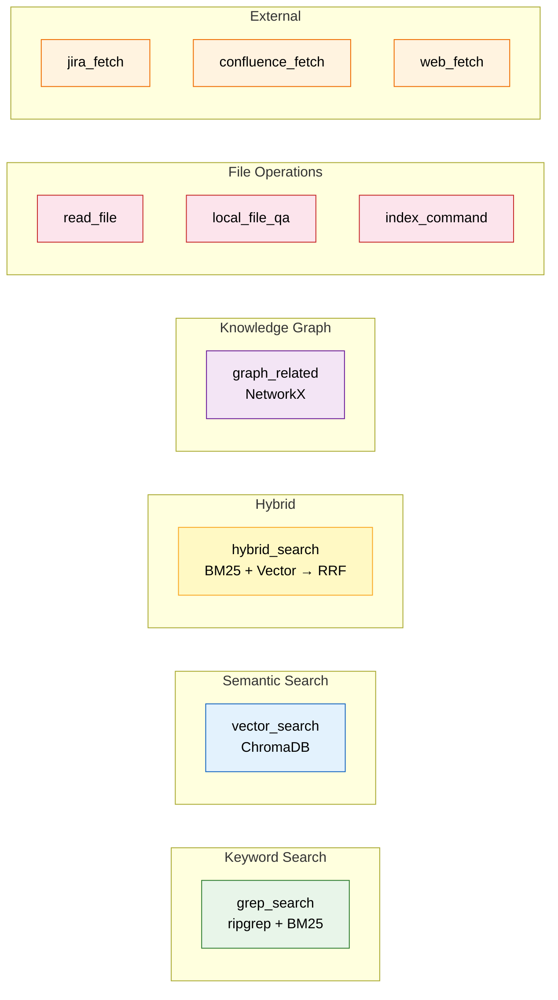
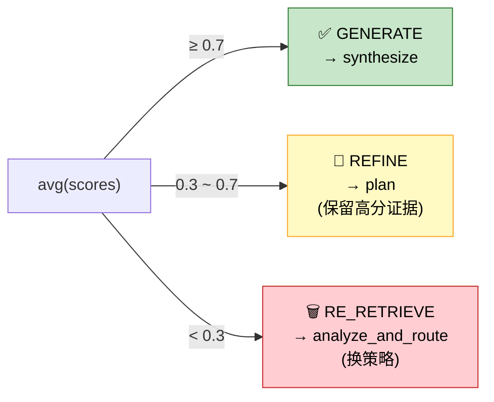
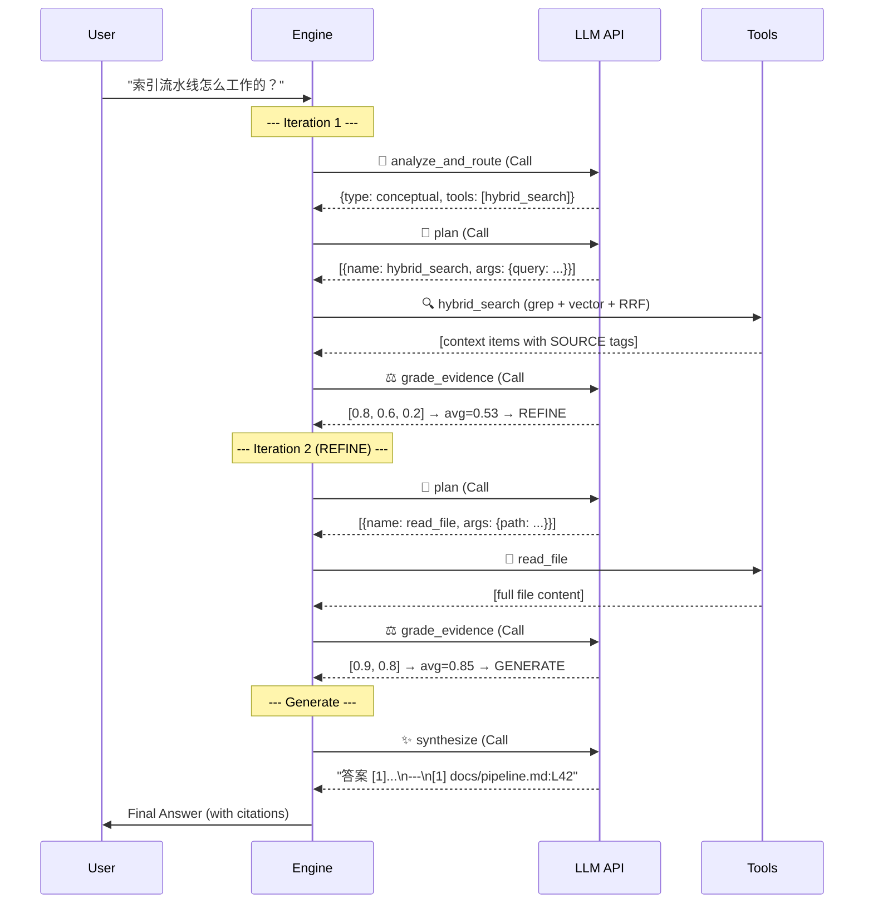

# Agentic RAG Architecture — Deep Dive

> **Last Updated**: 2026-03-01
> **Status**: Production (Post adaptive-rag-optimization refactor)

## Overview

KB Agent 采用 **6 节点自适应 CRAG (Corrective RAG)** 拓扑，由 [LangGraph](https://github.com/langchain-ai/langgraph) StateGraph 驱动。每次用户查询会经过「意图分析 → 工具规划 → 工具执行 → 证据评分 → 生成合成」的闭环流程，并在证据质量不足时自动重试。

---

## Flow Diagram



---

## Nodes Detail

### Node 1: `analyze_and_route` (意图分析)

| 属性 | 值 |
|------|----| 
| 源文件 | `agent/nodes.py:225` |
| LLM 调用 | ✅ 1 次 |
| 输入 | `query`, `messages` |
| 输出 | `query_type`, `sub_questions`, `routing_plan` |

**功能**: 将用户查询分类为 4 种意图之一，并建议最优工具组合：

| Intent Type | 首选工具 | 示例查询 |
|---|---|---|
| `exact` | `grep_search` | "PROJ-123 状态", "KB_AGENT_MAX_ITERATIONS" |
| `conceptual` | `vector_search` / `hybrid_search` | "索引流水线怎么工作的？" |
| `relational` | `graph_related` | "PROJ-100 关联了哪些 ticket？" |
| `file_discovery` | `local_file_qa` | "查找关于认证的文件" |

---

### Node 2: `plan` (工具规划)

| 属性 | 值 |
|------|----| 
| 源文件 | `agent/nodes.py:303` |
| LLM 调用 | ✅ 1 次 |
| 输入 | `query`, `routing_plan`, `context`, `tool_history` |
| 输出 | `pending_tool_calls` |

**功能**: 根据 `routing_plan` 和已有 `context`，LLM 决定下一步要调用哪些工具及其参数。输出为 JSON 数组 `[{name, args}]`。

---

### Node 3: `tool_exec` (工具执行)

| 属性 | 值 |
|------|----| 
| 源文件 | `agent/nodes.py:512` |
| LLM 调用 | ❌ 无 |
| 输入 | `pending_tool_calls` |
| 输出 | `context` (追加), `tool_history` |

**功能**: 逐个执行 `plan` 节点安排的工具调用，将结果追加到 `context`。每条结果带有 `[SOURCE:path:L{line}]` 前缀，用于后续引用追踪。

**可用工具 (9 个)**:



---

### Node 4: `grade_evidence` (CRAG 证据评分)

| 属性 | 值 |
|------|----| 
| 源文件 | `agent/nodes.py:633` |
| LLM 调用 | ✅ 1 次 (批量评分) |
| 输入 | `query`, `context` |
| 输出 | `evidence_scores`, `grader_action`, `context` (过滤后) |

**功能**: 对每条 evidence 打分 (0.0-1.0)，过滤低分项 (< 0.3)，并根据平均分决定下一步行动：



---

### Node 5: `synthesize` (答案合成)

| 属性 | 值 |
|------|----| 
| 源文件 | `agent/nodes.py:743` |
| LLM 调用 | ✅ 1 次 |
| 输入 | `query`, `context`, `messages` |
| 输出 | `final_answer` |

**功能**: 基于过滤后的 evidence 生成最终答案，强制要求：
- **Anti-Hallucination**: 只能使用提供的证据 — 禁止使用自身知识
- **Citations**: 内联脚注 `[1]`, `[2]` + 末尾 References 区域
- **No-Evidence Refusal**: 无证据时直接拒绝回答

---

## LLM API 调用分析

这是当前最大的性能瓶颈。每次用户查询的 LLM 调用次数：

| 场景 | LLM Calls | 工具调用 | 总耗时估计 |
|------|-----------|----------|-----------|
| **Best Case** (一轮命中) | 4 | 1-2 | ~4-6s |
| **REFINE** (一轮精化) | 7 | 2-4 | ~8-12s |
| **RE_RETRIEVE** (重新检索) | 8 | 3-6 | ~10-15s |
| **Worst Case** (3 轮迭代) | 12 | 6-9 | ~15-20s |



---

## 可能的增强方向

### 🔥 P0: 减少 LLM 调用次数 (Reducing API Latency)

| 方案 | 预期效果 | 复杂度 |
|------|---------|--------|
| **合并 analyze + plan 为单节点** | -1 call (3→2 per iteration) | 低 |
| **轻量级 grade 跳过** (context 命中率高时直接 GENERATE) | -1 call (命中时) | 低 |
| **streaming synthesize** | 感知延迟降低 50%+ | 中 |
| **并行工具执行** (tool_exec 内部并发) | 工具等待时间归并 | 中 |
| **LLM 缓存** (相同 query+context 不重复调用) | 重复查询 0 call | 中 |

### 🎯 P1: 搜索质量

| 方案 | 预期效果 | 复杂度 |
|------|---------|--------|
| **中文 BM25 分词** (jieba/pkuseg) | 中文检索准确率提升 | 低 |
| **Reranker 模型** (BGE-reranker / Cohere) | 替代 LLM grading, 更快更精准 | 中 |
| **Query Expansion** (同义词扩展) | 召回率提升 | 低 |
| **Chunk overlap** (索引时窗口重叠) | 防止跨 chunk 信息丢失 | 低 |

### 💡 P2: 用户体验

| 方案 | 预期效果 | 复杂度 |
|------|---------|--------|
| **SSE Streaming** (逐 token 输出) | 首字时间 <1s | 高 |
| **进度百分比** | 用户知道处于第几轮 | 低 |
| **Source Preview** (点击引用预览原文) | 增强可信度 | 中 |
| **Feature Flag** (`KB_AGENT_USE_ADAPTIVE_RAG`) | 新旧模式切换 | 低 |

---

## File Map

```
src/kb_agent/agent/
├── state.py     # AgentState TypedDict (17 fields)
├── graph.py     # LangGraph 拓扑定义 (5 nodes, 6 edges)
├── nodes.py     # 5 个 node 函数 + prompts (~800 lines)
└── tools.py     # 9 个 @tool wrappers + hybrid_search RRF
```

## Environment Variables

| Variable | Default | Description |
|----------|---------|-------------|
| `KB_AGENT_MAX_ITERATIONS` | `3` | 最大 plan→tool→grade 循环次数 |
| `KB_AGENT_LLM_API_KEY` | - | LLM API 密钥 |
| `KB_AGENT_LLM_BASE_URL` | - | LLM 端点 URL |
| `KB_AGENT_LLM_MODEL` | - | 模型名称 |
